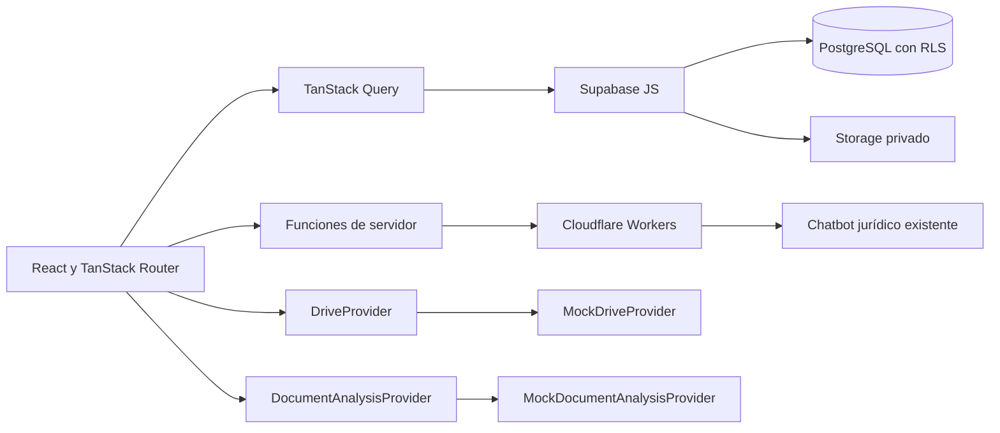

# Arquitectura

## Componentes principales

`DriveProvider` y `DocumentAnalysisProvider` son contratos. En esta fase solo las implementaciones simuladas ejecutan operaciones; las clases futuras de Google Drive, Gemini y OpenAI fallan de forma explícita si alguien intenta usarlas sin configuración.

## Organización del código

- `src/routes`: pantallas y composición de rutas.
- `src/components/legal`: paneles reutilizables de expediente.
- `src/hooks/legal`: lectura y mutaciones de partes, actuaciones y tareas.
- `src/lib/legal`: reglas, validaciones, normalización y datos demostrativos.
- `src/lib/imports`: contratos de Drive y procesamiento en segundo plano.
- `src/lib/ai-review`: contratos de análisis, simulador y decisiones de revisión.
- `supabase/migrations`: cambios de base de datos ordenados.
- `tests`: pruebas unitarias de dominio y proveedores.

## Compatibilidad

La ruta `/casos` y la tabla `cases` se conservan. Las columnas heredadas continúan alimentando el CRM:

| Campo heredado       | Campo ampliado                    |
| -------------------- | --------------------------------- |
| `clients.name`       | nombre canónico durante esta fase |
| `clients.dni`        | `clients.document_number`         |
| `cases.expediente`   | `cases.case_number`               |
| `cases.process_type` | `cases.case_type`                 |
| `cases.juzgado`      | `cases.court`                     |
| `documents.name`     | `documents.display_name`          |
| `documents.type`     | `documents.document_type`         |

Los formularios nuevos escriben ambos campos cuando existe una equivalencia segura.

## Procesamiento futuro

Una importación se separa en inventario, procesamiento por documento, consolidación por carpeta, revisión humana y confirmación. `BackgroundJobDispatcher` e `ImportWorkflowRunner` permiten conectar más adelante Cloudflare Queues o Workflows sin mover reglas de negocio a una petición HTTP prolongada.

## Seguridad

- Supabase Auth emite la sesión del usuario.
- RLS valida `is_staff()` o `is_admin()` en PostgreSQL.
- Storage usa un bucket privado y enlaces temporales.
- Los secretos solo se leen en servidor o Cloudflare Secrets.
- Las propuestas automáticas no se convierten en datos jurídicos confirmados sin revisión.
- No existe multiorganización en el modelo actual; añadir `organization_id` requerirá una migración transversal antes de ofrecer el CRM a terceros.
