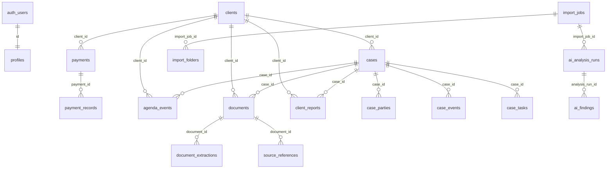

# Data Model

Fuente: `supabase/schema.sql`, migraciones, `src/lib/database.types.ts` y hooks de uso.

## Usuarios, perfiles y organizaciones

`auth.users`: tabla administrada por Supabase Auth. No definida en el repo. `profiles.id` referencia `auth.users(id)` en `supabase/schema.sql:53`.

`profiles`: perfil del personal. Columnas: `id`, `full_name`, `email`, `phone`, `role`, `status`, `initials`, `created_at` (`supabase/schema.sql:52` a `:63`). Obligatorios: `full_name`, `email`, `role`, `status`, `initials`. Restricciones: roles `Administrador`/`Personal` y estado `Activo`/`Inactivo` (`supabase/schema.sql:57` a `:60`). RLS final: select staff, insert/update admin (`supabase/schema.sql:459` a `:462`). Trigger de alta desde auth: `handle_new_user` (`supabase/schema.sql:14`) y trigger `on_auth_user_created` (`supabase/schema.sql:45`). Uso: `src/hooks/use-auth.tsx:28`, `src/hooks/use-profiles.ts:17`.

Organizaciones/tenant: no hay tabla `organizations`, `tenants` ni `organization_id` confirmada. El sistema actual parece mono-estudio; RLS filtra por rol activo, no por tenant.

## Clientes

`clients`: representa al cliente principal. Columnas base: `id`, `name`, `initials`, `color`, `dni`, `phone`, `email`, `address`, `birthdate`, `civil_status`, `process_type`, `status`, `registered_at`, `created_at` (`supabase/schema.sql:86` a `:102`). Columnas agregadas: `document_type`, `document_number`, `whatsapp`, `occupation`, `notes`, `updated_at`, `created_by` (`supabase/migrations/20260721090000_legal_case_foundation.sql:58` a `:64`). Obligatorios base: `name`, `initials`, `dni`, `phone`, `process_type`. Indices: `clients_document_number_idx`, `clients_phone_idx` (`20260721090000...:330` a `:331`). RLS final: staff select/insert/update, admin delete (`supabase/schema.sql:468` a `:472`). Usos: `src/hooks/use-clients.ts:20`, `src/routes/_app.clientes.index.tsx:20`, ZIP en `src/components/zip-import.tsx:572`.

## Expedientes / casos

`cases`: entidad canonica de expediente. Columnas base: `id`, `client_id`, `expediente`, `process_type`, `priority`, `next_hearing`, `status`, `juzgado`, `demandante`, `demandado`, `notes`, `created_at` (`supabase/schema.sql:129` a `:147`). `client_id` referencia `clients(id)` y `expediente`, `process_type`, `juzgado` son not null (`supabase/schema.sql:131` a `:142`). Columnas agregadas: `internal_code`, `case_name`, `case_type`, `legal_area`, `case_stage`, `court`, `judicial_district`, `case_number`, `case_year`, `judge_or_prosecutor`, `filing_date`, `closing_date`, `current_summary`, `current_status_description`, `last_action_date`, `next_action`, `responsible_user_id`, `updated_at`, `created_by` (`20260721090000...:74` a `:92`). Backfill desde campos heredados en `:94` a `:105`. Indices: `cases_client_status_idx`, `cases_case_number_idx`, `cases_responsible_idx` (`:332` a `:334`). RLS final: staff select/insert/update, admin delete (`supabase/schema.sql:478` a `:482`). Usos: `src/hooks/use-cases.ts:15`, `src/routes/_app.casos.index.tsx:54`, ZIP en `src/components/zip-import.tsx:600`.

## Documentos

`documents`: metadata de archivos en Storage. Columnas base: `id`, `name`, `type`, `size`, `storage_path`, `client_id`, `case_id`, `uploaded_at`, `created_at` (`supabase/schema.sql:274` a `:284`). `client_id` y `case_id` son opcionales y usan `on delete set null` (`supabase/schema.sql:280` a `:281`). Columnas agregadas: `original_name`, `display_name`, `document_type`, `mime_type`, `source_type`, `source_provider`, `external_file_id`, `external_folder_id`, `external_url`, `document_date`, `file_size`, `checksum`, `processing_status`, `verification_status`, `is_confidential`, `updated_at`, `created_by` (`20260721090000...:110` a `:126`). Indices: `documents_case_processing_idx`, `documents_external_file_idx` (`:336` a `:337`). RLS final: staff select/insert, admin delete (`supabase/schema.sql:512` a `:514`). Usos: `src/hooks/use-documents.ts:13`, upload manual `src/hooks/use-documents.ts:34`, ZIP `src/components/zip-import.tsx:647`.

## Pagos

`payments`: honorarios por cliente. Columnas base: `id`, `client_id`, `service`, `fees`, `paid`, `total_installments`, `paid_installments`, `status`, `created_at` (`supabase/schema.sql:174` a `:185`). `case_id` opcional agregado en `20260721090000...:108`. RLS: staff select, admin insert/update (`supabase/schema.sql:487` a `:490`). Usos: `src/hooks/use-payments.ts:15`, `src/routes/_app.pagos.index.tsx:45`.

`payment_records`: abonos. Columnas `id`, `payment_id`, `amount`, `method`, `receipt`, `notes`, `payment_date`, `created_at` (`supabase/schema.sql:208` a `:217`). FK `payment_id -> payments` (`:210`). RLS admin select/insert (`supabase/schema.sql:494` a `:497`). Uso: `src/hooks/use-payments.ts:31`, `:61`.

## Agenda y notificaciones

`agenda_events`: `id`, `title`, `type`, `event_date`, `event_time`, `location`, `client_id`, `case_id`, `created_at` (`supabase/schema.sql:235` a `:246`). Indice `agenda_events_case_id_idx` (`supabase/schema.sql:415`). RLS staff CRUD (`supabase/schema.sql:503` a `:507`). Google ID se usa en `src/hooks/use-agenda.ts:30`; columna agregada en migracion de calendario (No confirmado rango exacto para `gcal_event_id` en esta pasada). Las notificaciones no tienen tabla propia: se derivan de `agenda_events` en `src/hooks/use-notifications.ts:46`.

## Reportes

`client_reports`: bitacora/reportes por cliente/caso. Columnas y FK: `client_id -> clients`, `case_id -> cases`, `author_id -> profiles` (`supabase/migrations/20260713131000_add_client_reports.sql:4` a `:19`). Indices en `supabase/schema.sql:343` y `:346`. RLS final: staff select, staff insert con `author_id = auth.uid()`, update admin/autor, delete admin (`supabase/schema.sql:520` a `:526`). Uso: `src/hooks/use-reports.ts:35`, `src/routes/_app.reportes.index.tsx:459`.

## Expediente extendido

- `case_parties`: personas y roles del expediente; columnas/FK en `20260721090000...:134` a `:152`; uso `src/hooks/legal/use-case-management.ts:22`.
- `document_extractions`: resultados de extraccion/OCR; columnas en `:154` a `:171`; no se encontro escritura real desde ZIP actual.
- `case_events`: actuaciones; columnas/FK en `:173` a `:195`; uso `src/hooks/legal/use-case-management.ts:71`.
- `case_tasks`: tareas; columnas/FK en `:197` a `:219`; uso `src/hooks/legal/use-case-management.ts:107`.

## Importaciones e IA

- `import_jobs`: sesiones de importacion; columnas en `20260721090000...:221` a `:247`. No usado por ZIP actual.
- `import_folders`: carpetas detectadas; columnas en `:249` a `:265`. No usado por ZIP actual.
- `ai_analysis_runs`: corridas IA; columnas en `:267` a `:289`.
- `ai_findings`: hallazgos; columnas en `:291` a `:313`; uso `src/lib/ai-review/findings-service.ts:67`.
- `source_references`: evidencia; columnas en `:315` a `:326`; uso `src/lib/ai-review/findings-service.ts:117`.

RLS generica para tablas nuevas: staff select/insert/update y admin delete generada dinamicamente (`20260721090000...:370` a `:400`). Triggers `updated_at` en `:403` a `:432`.

## Configuraciones

No hay tabla de configuracion confirmada. Preferencias de notificacion usan `localStorage` segun `HANDOFF.md:84` y `src/routes/_app.configuracion.index.tsx:987`.

## Respuestas de dominio

- `process_type` existe en `clients.process_type` (`supabase/schema.sql:97`) y `cases.process_type` (`supabase/schema.sql:133`).
- Actualmente el proceso se duplica entre cliente y expediente. Recomendacion: el proceso juridico debe pertenecer al expediente.
- Un cliente puede tener varios expedientes: si, `cases.client_id`.
- Un expediente puede tener varios clientes: no como titularidad canonica; `case_parties.client_id` es opcional para partes.
- Numero de expediente: `cases.expediente` es not null; `case_number` agregado es nullable.
- Expedientes provisionales: No confirmado; UI exige `N Expediente *` (`src/routes/_app.casos.index.tsx:620`) y DB exige `expediente not null`.

## Actualizacion core CRM - 2026-07-23

No hubo cambios de esquema en esta fase. El trabajo fue de capa de aplicacion, validacion y sincronizacion de cache.

Uso actual por modulo:

- Clientes: usa `clients` y conserva los campos existentes. La UI permite archivar con `status = "Archivado"` para evitar borrado duro accidental desde la ficha.
- Expedientes: usa `cases` como entidad canonica. Los estados ingresados desde formularios e importacion se normalizan al catalogo soportado antes de persistir.
- Documentos: `documents.case_id` puede quedar `null` cuando el ZIP no permite identificar un expediente con suficiente confianza. Esto evita asociaciones incorrectas.
- Reportes: `client_reports` sigue siendo la bitacora por cliente y expediente, con `author_id` asociado al usuario autenticado.
- Pagos y Agenda: no cambiaron tablas; se conectaron a invalidaciones compartidas para refrescar vistas relacionadas.

No se crearon migraciones nuevas, funciones SQL nuevas ni tablas de auditoria. La auditoria persistida sigue siendo una recomendacion pendiente si el estudio requiere trazabilidad formal de ediciones, archivados y eliminaciones.
