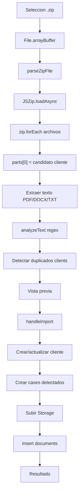

# Import Pipeline

Este documento describe el ZIP actual. No describe la arquitectura futura.

## Paso a paso real

1. Seleccion: `handleFile(f: File)` valida extension `.zip` (`src/components/zip-import.tsx:452` a `:457`), lee `f.arrayBuffer()` (`:465`) y llama `parseZipFile` (`:466`). Input HTML acepta ZIP en `:772` a `:780`.
2. Descompresion: `parseZipFile(zipBuffer, onProgress)` retorna `Promise<ZipParseResult>` (`src/lib/imports/zip-import.ts:335` a `:338`) y usa `JSZip.loadAsync` (`:341` a `:347`).
3. Recorrido: `zip.forEach` recorre archivos, omite directorios (`src/lib/imports/zip-import.ts:362` a `:365`), separa ruta por `/` (`:366`).
4. Ignorados: omite segmentos ocultos/sistema con `shouldIgnorePath` (`:369` a `:372`); prefijos en `:33` a `:34`.
5. Cliente candidato: la regla unica es `const topFolder = parts[0]` (`:375` a `:377`). Por eso `A-EXPEDIENTES DE CLIENTES` termina como cliente si es primer nivel del ZIP.
6. Extensiones: solo procesa `ALLOWED_EXTENSIONS` (`:17` a `:31`, `:380` a `:383`).
7. Normalizacion: `normalizeFolderName` elimina sufijos `(1)`, espacios repetidos y trim (`:178` a `:184`).
8. Clasificacion: `classifyDocument` usa patrones de nombre (`:39` a `:51`, `:191` a `:197`).
9. Hash: `sha256` calcula SHA-256 (`:171` a `:176`).
10. PDF: heuristica `BT`, `ET`, `/Font` (`:225` a `:231`) y extraccion manual de strings en streams (`:233` a `:267`). PDFs escaneados quedan `ocr_required` (`:449` a `:461`).
11. DOCX/DOC: `mammoth.extractRawText` (`:269` a `:276`) se aplica a `.docx` y `.doc` (`:434`). `.doc` binario antiguo: No confirmado.
12. TXT/RTF/ODT: decodifica UTF-8 sin parser estructural (`:462` a `:471`).
13. Datos: `analyzeText` usa regex para DNI, email, processType, juzgado, partes, etapa, expediente (`:280` a `:326`).
14. Expedientes: usa `PATTERNS.expediente` y `expedienteAlt` (`:59` a `:60`, `:293` a `:297`). Si no hay match, no crea `cases`.
15. Duplicados: consulta `clients` (`src/components/zip-import.tsx:474` a `:480`) y arma `ReviewCandidate` (`:489` a `:494`). No revisa error de la consulta de clientes.
16. Preview: permite editar nombre/datos, excluir carpeta/archivos y escoger accion para duplicados.
17. Importacion: filtra candidatos activos y duplicados resueltos (`src/components/zip-import.tsx:519` a `:526`).
18. Cliente: crea `clients` con fallback `00000000`, `000000000`, `Defensa penal - Otros` (`:554` a `:573`); actualiza existentes en `:575` a `:583`; adjunta docs en `:585` a `:586`.
19. Expedientes: itera `candidate.detected.expedientes.slice(0, 5)` (`:591` a `:594`) e inserta `cases` (`:600` a `:614`).
20. Storage: crea path `clientId/Date.now_safeName` (`:635` a `:637`) y sube al bucket `documents` (`:639` a `:642`).
21. Documentos: asigna `caseId = caseIds[0] ?? null` (`:644`) e inserta en `documents` (`:647` a `:664`).
22. Resultado: marca success/failed por carpeta (`:672` a `:707`).

## Respuestas especificas

- Como decide que carpeta es cliente: siempre primer segmento `parts[0]`.
- Como decide expediente: solo por regex sobre texto extraido de documentos.
- Condicion para crear expediente: `detected.expedientes.length > 0`; loop en `src/components/zip-import.tsx:594`.
- Por que puede no crear expediente: PDF escaneado, texto no extraido, expediente en nombre/carpeta y no en texto, regex no coincide, documento binario.
- De donde obtiene `process_type`: `candidate.edits.processType`, luego `candidate.detected.processType`, luego fallback (`src/components/zip-import.tsx:563` a `:566`, `:596` a `:599`).
- Por que aparecen frases completas como proceso: regex `processType` captura texto libre despues de palabras como `MATERIA` o `PROCESO` (`src/lib/imports/zip-import.ts:69` a `:70`) sin catalogo ni normalizacion.
- Juzgado: usa `firstMatch(text, PATTERNS.court)` (`:284`), pero `firstMatch` devuelve grupo 1 (`:206` a `:210`) y `PATTERNS.court` no tiene grupo (`:63`). Probable resultado: `undefined`. `PATTERNS.juzgado` existe (`:61` a `:62`) pero no se usa.
- DNI: requiere `DNI` + 8 digitos (`:56`, `:281`).
- Partes: `demandante` y `demandado` por regex (`:64` a `:67`, `:285` a `:286`).
- Varios expedientes por cliente: crea hasta 5 cases, pero todos los documentos se vinculan al primer `caseIds[0]` (`src/components/zip-import.tsx:644`).
- Varios clientes dentro de una carpeta: no los distingue; todo se agrupa bajo `parts[0]`.
- Carpetas contenedoras: no hay deteccion; se convierten en candidatos cliente.
- Documentos sueltos: no exige carpeta real; el algoritmo toma `parts[0]`, por lo que un archivo en raiz puede comportarse como candidato anomalo. No confirmado con prueba manual.
- Errores parciales: parseo agrega warnings (`src/lib/imports/zip-import.ts:486` a `:490`); importacion de documento traga errores (`src/components/zip-import.tsx:667` a `:669`).
- Transacciones: no usa.
- Inconsistencias: si, puede dejar clientes sin expedientes, archivos sin registro, documentos sin expediente, o resultado success parcial.
- Supabase: revisa error al crear cliente (`src/components/zip-import.tsx:572` a `:573`), no revisa error al crear cases ni documents.
- Storage: revisa `uploadErr` (`:639` a `:642`).
- Hashes: si calcula y guarda `checksum` (`src/lib/imports/zip-import.ts:171`, `src/components/zip-import.tsx:658`).
- Duplicados reales: parcial; clientes por DNI/nombre/telefono. No deduplica expedientes ni candidatos internos del ZIP.

## Estado tras Fase 1 - 2026-07-22

El ZIP ya no interpreta automaticamente la carpeta de primer nivel como cliente. Primero reconstruye el arbol completo, clasifica carpetas y propone candidatos de cliente y expediente para revision humana. La persistencia solo ocurre al confirmar y valida errores de Supabase/Storage en cada paso. Si un documento se sube a Storage pero falla su fila en `documents`, se intenta retirar el objeto subido y se reporta compensacion.

CSV/XLSX no se mezclan con este flujo; permanecen en el importador tabular.
