# Project Overview

Fecha: 2026-07-22. Rama revisada: `rescue/fase-2a-antigravity`. Ultimo commit base: `0ae19c2 feat: implementar importacion documental ZIP`.

## Identidad y objetivo

El repositorio implementa el CRM Juridico del Estudio Juridico Arenas. El objetivo funcional visible es administrar clientes, expedientes/casos, documentos, agenda, tareas, pagos y reportes. Evidencia: `README.md:1`, `README.md:3`, menu en `src/components/app-layout.tsx:30`.

La jerarquia de dominio esperada por el negocio es:

```mermaid
flowchart TD
  U["Usuario autenticado"] --> CRM["CRM Juridico"]
  CRM --> C["Cliente"]
  C --> E["Expediente / case"]
  E --> D["Documentos"]
  C --> P["Pagos"]
  C --> R["Reportes"]
  E --> T["Tareas / actuaciones"]
  CRM --> A["Agenda"]
  CRM --> I["Importaciones"]
  CRM --> AI["Revision IA"]
```

## Usuarios y permisos visibles

Hay dos roles de negocio: `Administrador` y `Personal`, definidos por check constraint en `profiles.role` (`supabase/schema.sql:57`). La navegacion oculta `Pagos` y `Configuracion` para no administradores usando `adminOnly` (`src/components/app-layout.tsx:35`, `src/components/app-layout.tsx:39`).

## Modulos actuales

- Dashboard: `src/routes/_app.index.tsx:25`.
- Clientes: `src/routes/_app.clientes.index.tsx:10`; detalle `src/routes/_app.clientes.$id.tsx:34`.
- Expedientes/Casos: `src/routes/_app.casos.index.tsx:24`; detalle usa `useCase` en `src/routes/_app.casos.$id.tsx:73`.
- Documentos: `src/routes/_app.documentos.index.tsx:42`.
- Agenda y tareas: `src/routes/_app.agenda.index.tsx:77`.
- Pagos: `src/routes/_app.pagos.index.tsx:45`.
- Importaciones: `src/routes/_app.importaciones.index.tsx:16`.
- Revision de IA: `src/routes/_app.revision-ia.index.tsx:30`.
- Reportes: `src/routes/_app.reportes.index.tsx:459`.
- Configuracion: `src/routes/_app.configuracion.index.tsx:69`.

## Stack tecnologico

- TypeScript estricto: `tsconfig.json:18`.
- React 19, TanStack Start/Router/Query, Vite 8, Tailwind 4: `package.json:51` a `package.json:76`.
- Supabase Auth/Postgres/Storage: `@supabase/supabase-js` en `package.json:51`.
- UI: Radix, Lucide, shadcn-style components.
- Documentos/importacion: `exceljs`, `mammoth`; `jszip` se usa directamente pero es transitivo.
- Deploy: Nitro + Cloudflare Workers + Wrangler (`wrangler.toml:1`, `package.json:12`).

## Framework y configuracion

`vite.config.ts:1` documenta que `@lovable.dev/vite-tanstack-config` ya incluye TanStack Start, React, Tailwind, tsconfig paths, Nitro, inyeccion `VITE_*` y protecciones del build. `vite.config.ts:8` define el server entry como `src/server.ts`. El alias `@/*` apunta a `src/*` (`tsconfig.json:25`).

## Servicios externos

- Supabase requerido: `.env.example:9` y `.env.example:10`.
- Google Calendar opcional: `.env.example:29`, usado por `src/lib/google-calendar.ts:13`.
- Groq chatbot: `.env.example:16`.
- Google Drive, OpenAI, Gemini, Cloudflare Queue/Workflow aparecen como futuras variables privadas (`.env.example:36` a `.env.example:41`), pero no estan conectadas al ZIP actual.

No se copiaron ni revelaron valores secretos.

## Comandos reales

- Desarrollo: `npm run dev` (`package.json:8`).
- Build: `npm run build` (`package.json:9`).
- Preview: `npm run preview` (`package.json:11`).
- Deploy: `npm run deploy` (`package.json:12`).
- Tests locales: `npm test` (`package.json:14`).

## Dependencias criticas

Directas: `@supabase/supabase-js`, `@tanstack/react-query`, `@tanstack/react-router`, `@tanstack/react-start`, `exceljs`, `mammoth`, `openai`, `@google/generative-ai`, `wrangler`, `nitro`.

Dependencia transitiva usada directamente: `jszip` se importa en `src/lib/imports/zip-import.ts:10`; `npm ls jszip --depth=4` confirmo que llega por `exceljs` y `mammoth`, no como dependencia directa de `package.json`.

## Entradas principales

- Cliente: `src/start.ts`.
- Router: `src/router.tsx` y `src/routeTree.gen.ts`.
- SSR/server: `src/server.ts`, referenciado por `vite.config.ts:8`.
- Root: `src/routes/__root.tsx`.
- App protegida: `src/routes/_app.tsx`.
- Layout: `src/components/app-layout.tsx`.

## Estructura relevante

- `src/routes`: paginas visibles y callbacks.
- `src/hooks`: hooks de Supabase por entidad.
- `src/components`: layout, importadores, busqueda, UI y paneles.
- `src/lib/imports`: Drive provider mock/contratos y parser ZIP.
- `src/lib/ai-review`: servicios y estado de revision IA.
- `src/lib/legal`: schemas, normalizacion y demo data.
- `supabase/schema.sql` y `supabase/migrations`: modelo de datos.
- `tests`: pruebas unitarias/locales y remoto opcional.

## Contradicciones detectadas

`README.md:17`, `README.md:74` y `docs/import-workflow.md:5` describen importaciones como demostrativas/sin persistencia. El codigo actual de ZIP si persiste clientes, expedientes y documentos en `src/components/zip-import.tsx:572`, `src/components/zip-import.tsx:600` y `src/components/zip-import.tsx:647`.

