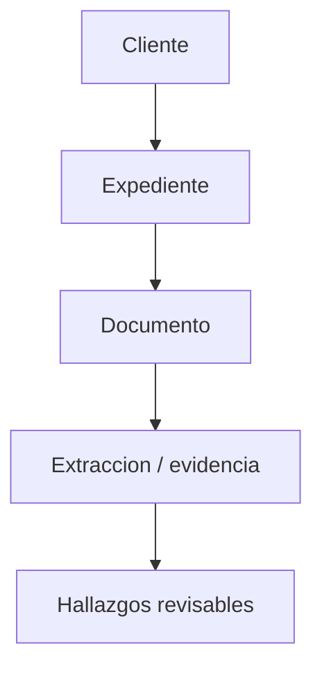
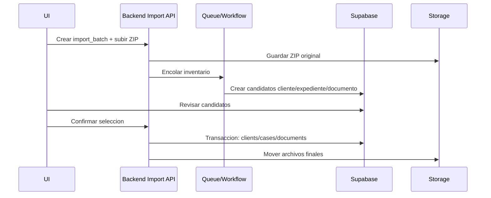

# Target Architecture

Este documento es recomendacion futura. No describe estado implementado.

## Principio de dominio

La fuente canonica debe ser:

El cliente no debe cargar el tipo juridico de cada proceso como fuente principal. `process_type` debe vivir en expediente/caso; el cliente puede tener una materia inicial o resumen comercial.

## Modelo recomendado

- `clients`: identidad, contacto, datos personales minimos.
- `cases`: expediente real o provisional, `client_id`, `case_number`, `case_type`, `court`, `status`, `confidence`, `is_provisional`.
- `documents`: metadata, storage path, `client_id` opcional, `case_id` opcional, `classification_status`.
- `import_batches`: sesion de importacion con estado, usuario, fuente, totales y errores.
- `import_client_candidates`: candidato cliente con confianza, datos detectados y decision humana.
- `import_case_candidates`: candidato expediente con cliente candidato, numero, juzgado, tipo, confianza.
- `import_document_candidates`: cada archivo con ruta original, hash, candidato expediente, tipo documental, estado OCR.
- `source_references`: evidencia por campo con pagina/extracto/confianza.

## Flujo recomendado

## Reglas clave

- Ningun cliente/case/documento real se crea antes de revision humana.
- Carpeta contenedora se clasifica como contenedor si su nombre coincide con patrones (`EXPEDIENTES`, `CLIENTES`, `A-`, etc.) o si contiene multiples carpetas con documentos.
- Expediente puede ser provisional si no hay numero: `is_provisional=true`, `case_number=null`, codigo interno generado.
- Documento puede quedar sin clasificar con `case_id=null`, pero debe aparecer en bandeja de revision.
- Cada campo detectado debe tener confianza y evidencia documental.
- PDF escaneado entra a OCR; no se interpreta como fallo silencioso.
- Procesamiento pesado va a backend/queue, no navegador.
- Google Drive real debe usar OAuth privado y guardar IDs externos, no depender de ZIP manual como fuente permanente.

## Componentes futuros

- Parser jerarquico de ZIP/Drive.
- Clasificador de carpetas.
- Extractor DOCX/PDF/OCR.
- Normalizador juridico de materias/estados/juzgados.
- Vista de revision por lote.
- Confirmacion transaccional.
- Auditoria y rollback por import batch.

